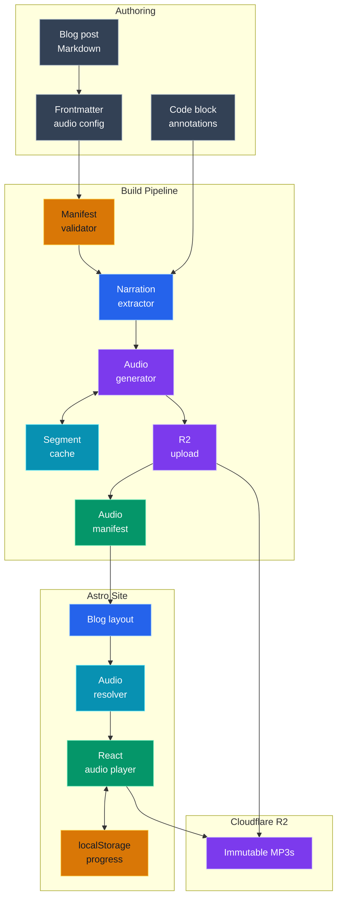
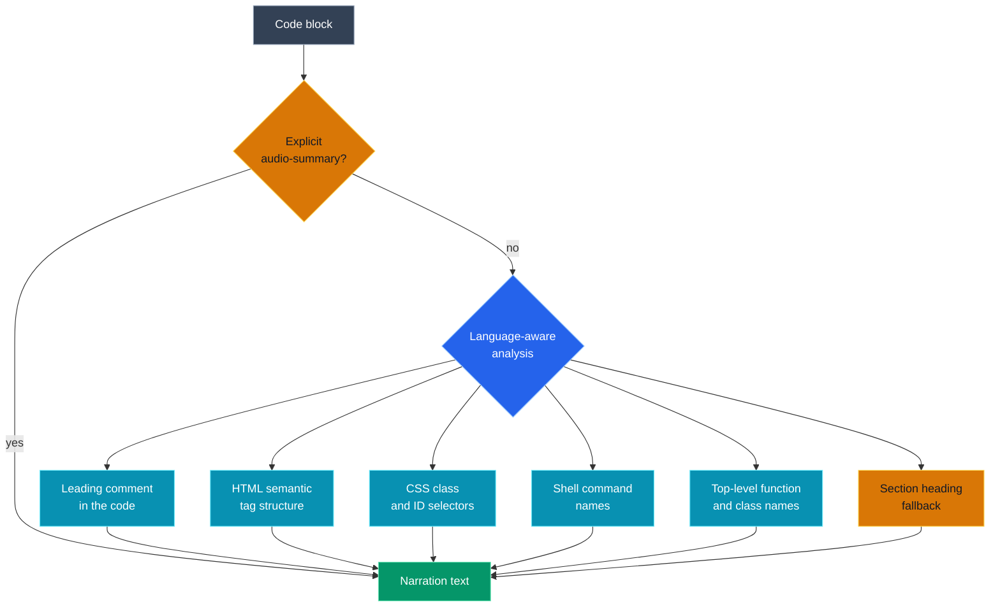
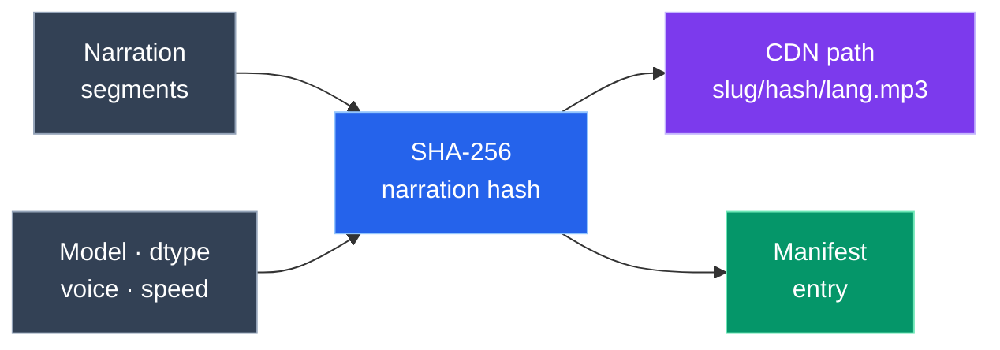
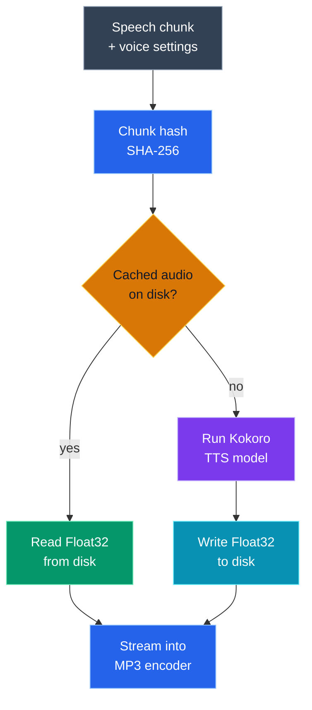
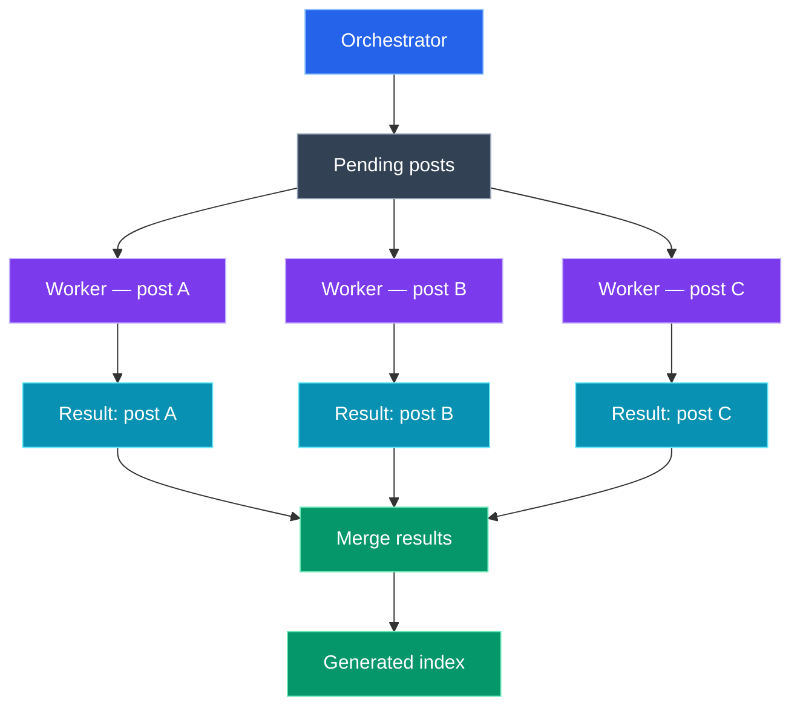
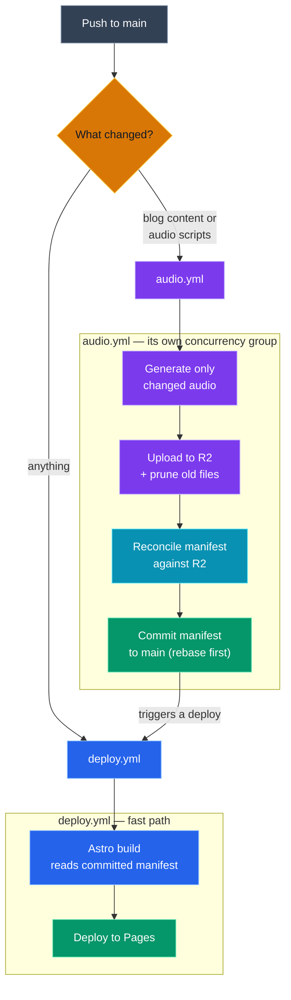

I wanted readers to be able to _listen_ to my blog posts on a commute, not just read them at a desk. The obvious path is a third-party SaaS that sprinkles a widget onto your page. I went the other way: a fully self-hosted pipeline that generates MP3s at build time, stores them on Cloudflare R2, and streams them through a tiny React player I control completely. No subscriptions, no vendor lock-in, no foreign JavaScript on my pages.

This post walks through how it actually works — the parts that were obvious, the parts that weren't, and a few decisions that took me longer to get right than I'd like to admit.

---

## The Goal

A few things I wasn't willing to compromise on before I wrote anything:

- Every published post gets a narration, automatically.
- Audio lives on a CDN. Bundling MP3s into the site would be absurd.
- Re-running the pipeline on unchanged posts should be instant.
- Editing one paragraph should not re-synthesize the whole article.
- Code blocks can't be read verbatim — no TTS model should narrate a wall of imports and braces.
- The player saves your position so you can pause on the train and pick up at your desk.
- If TTS has a bad day in CI, the blog post still deploys. Partial audio beats a blocked deploy.


---

## Tech Stack

This is the tech stack I used to build the audio pipeline, and the reasons I picked each piece.

- **Astro** powers this blog, so the audio system had to fit into its static build flow. It checks for audio at build time, which keeps the browser side simple.
- **React** powers the audio player because playback state, seeking, speed changes, and source switching are easier to manage in a small island.
- **Markdown AST tooling** parses posts properly instead of treating Markdown like plain text.
- **Kokoro-82M ONNX** generates the narration locally in Node. I picked it because the voice quality is surprisingly human, and because it is open source. I wanted control over the pipeline, not another paid API in the middle.
- **lamejs** turns raw audio samples into MP3s without adding native build dependencies.
- **Cloudflare R2** stores the final audio files. Audio is a static asset, so I wanted something fast, CDN-friendly, and cheap to serve globally.
- **The S3 SDK** uploads to R2 directly, which keeps CI simpler than shelling out to a CLI.
- **GitHub Actions** runs the pipeline, caches the heavy pieces, uploads new audio, and deploys the site. I didn't want to run a separate cloud service just for generation yet. If this grows, moving the audio job closer to Cloudflare would be a natural next step.
- **Bun** runs the project scripts and installs dependencies quickly in CI. For this workflow it is simply faster than waiting on npm or pnpm for every deploy.

I wanted the stack to be reliable and maintainable, not fancy. If I come back to this six months later, I should still understand why every piece exists.

---

## Architecture Overview

Here's the full picture before we go through each piece. 



---

## Extracting Narration from Markdown

Reading Markdown naively — line by line, with regex — falls apart immediately. Frontmatter, inline code, links, tables, and code fences all need different treatment. The right tool is a proper AST.

The narration extractor parses each post with `unified`, `remark-parse`, `remark-frontmatter`, and `remark-gfm`. It then walks the syntax tree and collapses everything into a flat sequence of typed segments:

- `title` — the post title, spoken once at the top.
- `heading` — section headings, used for pacing and contextual fallbacks.
- `prose` — paragraphs, list items, and table cells.
- `code-summary` — a human-readable description of a code block.

<!-- audio-summary: Here is a code block which builds a remark processor and walks the parsed Markdown AST to extract a flat list of narration segments along with any audio configuration from the frontmatter. -->
```js
const processor = unified()
  .use(remarkParse)
  .use(remarkFrontmatter, ['yaml'])
  .use(remarkGfm);

export async function extractNarration(filePath) {
  const source = await readFile(filePath, 'utf8');
  const tree = processor.parse(source);
  const frontmatter = frontmatterFromTree(tree);
  const audio = normalizedAudioConfig(frontmatter.audio);
  const { segments, missingCodeSummaries } = extractSegments(
    tree,
    frontmatter.title,
    audio,
  );

  return { audio, segments, missingCodeSummaries };
}
```

Downstream, nothing sees raw Markdown. The generator gets a flat list of typed text, whether that text originally came from a paragraph, a table cell, a blockquote, or a heading. Same shape, always.

The SHA-256 hash of those segments plus the voice settings becomes the post's narration hash. That single hash drives every decision further down — synthesize or skip, upload or skip, write a manifest entry or skip. If the hash hasn't changed, the run is instant. With 40+ posts, that matters.

---

## Code Blocks Need a Different Voice

Code is valuable on screen and terrible when read aloud verbatim. No listener wants to hear every brace, semicolon, import path, and indentation level narrated at them.

The system handles code blocks in two ways. You can place an explicit `<!-- audio-summary: ... -->` HTML comment directly before a code fence, and that text is used verbatim. Or you can set `codeSummaryMode: contextual` in the post's frontmatter, and the extractor derives a useful description from the code itself.



For each code block, the contextual engine looks for the most useful clue it can find: a leading comment, semantic structure, command names, selectors, or meaningful symbols. It skips generic names that do not help a listener and turns the useful parts into a short sentence:

<!-- audio-summary: Here is a code block explaining a function stripping comments from a code block and extracts the names of top-level functions, classes, and arrow-function constants, ignoring generic identifiers to produce a useful narration sentence. -->
```js
const GENERIC_IDENTIFIERS = new Set([
  'arr', 'cb', 'data', 'el', 'err', 'fn', 'i', 'item',
  'n', 'obj', 'req', 'res', 'result', 'val', 'value', 'x', 'y',
]);

function extractDefinedNames(code, language) {
  const names = [];
  const seen = new Set();
  const source = stripComments(code);

  for (const match of source.matchAll(
    /^( {0,2})(?:export\s+)?(?:async\s+function|function)\s+(\w+)/gm
  )) addName(match[2]);

  for (const match of source.matchAll(/^( {0,2})class\s+(\w+)/gm))
    addName(match[2]);

  for (const match of source.matchAll(
    /^( {0,2})(?:export\s+)?(?:const|let|var)\s+(\w+)\s*=\s*(?:async\s*)?(?:function|\(|\w)/gm,
  )) addName(match[2]);

  return names.slice(0, 4);
}
```

The difference sounds minor on paper. In practice, when a post has ten code blocks, the generic fallback gets repetitive fast. _"Here is a code block which defines animateRight and moveX in an async function"_ is actually useful. _"This JavaScript example illustrates async"_ ten times in a row is not.

---

## Multi-Voice Frontmatter

Each post controls its own audio through frontmatter. Opting in is one line. Specifying multiple voices — say, two different narration styles — is a list. The pipeline generates a separate MP3 for each, the player shows a selector, and switching between them mid-playback is seamless.

<!-- audio-summary: This frontmatter example opts a blog post into audio generation with two named voices and enables contextual code summarisation. -->
```yaml
audio:
  enabled: true
  voices:
    - voice: af_heart
      language: en
      label: English
    - voice: am_adam
      language: en-alt
      label: English (alternate)
  codeSummaryMode: contextual
```

Each voice gets its own hash, its own MP3, and its own manifest entry. Voice, model, dtype, and speed all feed into the hash — change any of them and you get a new file, not a stale one quietly served from cache.

---

## Hashes as the Contract

Every decision in the pipeline — synthesize or skip, upload or skip, re-run or not — comes down to a single SHA-256 hash computed from the narration segments and the voice settings.



The hash goes into the storage key itself, not just the metadata:

<!-- audio-summary: Here is a codeblock explaining the storage key embedding the narration hash so every published audio file has a content-addressed path — the URL never changes after upload. -->
```js
const storageKey = `audio/blog/${narration.slug}/${hash}/${language}.mp3`;
```

That URL is now permanent. Same content, same hash, same URL, forever. When a post changes, it gets a new hash and a new URL. The old file can stay cached on every CDN edge for a year — it will never serve the wrong audio for the current version of the article.

---

## Generating Audio with Kokoro

Kokoro-82M is a compact, high-quality TTS model from the HuggingFace hub. The ONNX version runs in Node via `kokoro-js`, no Python required. The `q8` quantization hits a good quality-to-speed balance on CPU, which matters a lot when running in CI.

The model has a practical input limit of around 420 characters per inference call. Long paragraphs need to be chunked before synthesis. The chunker prefers sentence boundaries and falls back to word boundaries when a single sentence is too long:

<!-- audio-summary: Here is a function which groups narration segments into speech chunks within the model's token limit, preferring sentence boundaries and adding punctuation to make transitions sound natural. -->
```js
export function buildSpeechChunks(segments, maxLen = 420) {
  const chunks = [];
  let current = '';

  for (const seg of segments) {
    const punctuated = /[.!?]$/.test(seg.text) ? seg.text : `${seg.text}.`;
    for (const part of splitLongText(punctuated, maxLen)) {
      const candidate = `${current} ${part}`.trim();
      if (candidate.length <= maxLen) current = candidate;
      else {
        if (current) chunks.push(current);
        current = part;
      }
    }
  }

  if (current) chunks.push(current);
  return chunks;
}
```

Segments are joined greedily before being split, so short heading and prose segments flow together as natural speech rather than being cut at every AST node boundary. Between chunks, a 220 ms silence gap is injected — enough to hear a pause between sections without sounding choppy.

`lamejs` handles the MP3 encoding. Rather than collecting the full `Float32Array` for the entire article and then encoding it all at once, the encoder receives chunks as they arrive from the TTS model. Peak memory stays proportional to one chunk at a time rather than the entire article.

---

## Segment Cache for Fast Edits

Text-to-speech generation is CPU-intensive, but most edits to a blog post are small. Fixing a typo in one paragraph should not require re-synthesizing the title, every heading, and every other paragraph. The segment cache makes sure it doesn't.

Every synthesized chunk is stored as a raw `Float32LE` file on disk, keyed by a SHA-256 of the chunk text and the voice settings. On the next run, the generator checks the cache before calling the TTS model:



The chunk hash covers the text, model, quantization dtype, voice, and speed — every input that affects the synthesized audio. That means the same paragraph text synthesized with two different voices produces two different cache keys, so changing a voice in frontmatter correctly triggers re-synthesis.

Cleanup is automatic. After a full run, the generator computes the live set of chunk hashes across all audio-enabled posts and removes any `.f32` files that are no longer referenced. Deleted paragraphs, renamed posts, and removed voices do not leave cache debris behind indefinitely.

---

## Parallel Workers and Recovery

With one post to generate, running serially is fine. With dozens, it wastes the CPU cores sitting idle while one post synthesizes at a time. When the orchestrator has multiple posts to process and enough cores available, it fans out work across up to four child processes:



Each worker handles one post. It loads the model, hits the segment cache, synthesizes whatever's missing, and writes a result file before it exits. Workers don't share state — they run independently and write separate files.

The result files double as crash recovery checkpoints. If a CI run is interrupted after three workers finish but before the fourth does, the next run validates each result file against the current narration hash. Workers whose results are still valid are skipped. Only the interrupted one gets re-dispatched.

---

## Publishing to Cloudflare R2

Cloudflare R2 speaks the S3 API, so the upload code can use the standard S3 client with a custom endpoint.

The only R2-specific part is that endpoint. Everything else is standard S3:

<!-- audio-summary: This code creates an S3 client pointed at Cloudflare R2 using environment-provided credentials, then uploads an MP3 with an immutable cache header so CDN edges can cache it indefinitely. -->
```js
const s3 = new S3Client({
  region: 'auto',
  endpoint: `https://${process.env.R2_ACCOUNT_ID}.r2.cloudflarestorage.com`,
  credentials: {
    accessKeyId: process.env.R2_ACCESS_KEY_ID,
    secretAccessKey: process.env.R2_SECRET_ACCESS_KEY,
  },
});

await s3.send(new PutObjectCommand({
  Bucket: process.env.R2_BUCKET,
  Key: storageKey,
  Body: body,
  ContentType: 'audio/mpeg',
  CacheControl: 'public, max-age=31536000, immutable',
}));
```

`CacheControl: immutable` is not optional here. The URL already encodes the hash — there's no version of "same URL, different audio". Browsers and CDN edges can cache these forever.

Before writing the public URL into the manifest, the uploader checks the full chain: does the source post still exist, is the language still configured, does the generated hash match what we'd compute today, is the MP3 on disk, and does its size exactly match the byte count the generator recorded. That last check is the corruption guard — a truncated or half-written render never gets uploaded, so a broken file can never have its hash recorded in the manifest. Only when every check passes is the URL written.

Because the storage key is content-addressed, editing a post produces a brand-new key. To stop the bucket from hoarding every past version, the uploader then prunes any object under a post's prefix that the current manifest no longer references — each voice keeps exactly one file. Same voice, edited text: the old MP3 is replaced, not accumulated.

---

## CI Keeps Everything in Sync

For a while, every push to main ran the whole thing — generate, upload, commit, build — as one workflow. That was a mistake. A pure styling tweak shouldn't wait behind a multi-hour synthesis run, and a run that got cancelled by my next push could drop the manifest commit entirely, which sent the *following* run off regenerating everything from scratch. So I split it into two pipelines.



`deploy.yml` builds and ships the site. It runs on every push to main, touches no audio at all, and simply trusts whatever is already committed in the manifest. Styling, logic, and prose changes go live in well under a minute.

`audio.yml` owns generation. It only triggers when blog content or the audio scripts change, and it runs in its own concurrency group with `cancel-in-progress: false` — so a long synthesis run finishes instead of being killed by the next unrelated push. When it's done it commits the manifest back to main, rebasing first so it never clobbers a concurrent change, and then explicitly triggers a deploy so the new URLs go live.

Both generation and upload still run with `continue-on-error: true`. If TTS has a bad day, the manifest simply doesn't change and the site keeps deploying with the audio that already exists.

The model weights, segment cache, worker result files, and staged MP3 output are cached between runs, keyed so that freshly synthesized segments are always persisted rather than thrown away. The first run is slow. Every run after that only processes what actually changed — and when nothing changed, the whole job finishes in seconds instead of hours.

After upload, a reconcile step rebuilds the manifest from what's genuinely published in R2: it keeps the entries the upload just wrote, recovers any that drifted, and drops anything whose audio isn't really there. The committed manifest is then guaranteed to match the bucket — which is exactly the invariant that used to break silently.

---

## The Browser Player

The player is a React island with `client:load`. It hydrates immediately — there's no useful static version of audio controls.

Before mounting anything, the blog layout checks the manifest for the current post's slug. If there are sources, the player gets them. If not, nothing renders. The check is a single function:

<!-- audio-summary: This utility reads the published audio manifest and returns the available audio sources for a given post slug, returning an empty array when no audio has been generated yet. -->
```ts
export interface AudioSource {
  url: string;
  label: string;
  language: string;
  duration?: number;
}

export function getPostAudio(slug: string): AudioSource[] {
  const post = manifest[slug];
  return post ? Object.values(post) : [];
}
```

The player doesn't know or care how the audio was made. It gets a URL, a label, a language code, and a duration. If I swap the TTS model tomorrow or move storage to a different CDN, the player component doesn't change.

A few things I put effort into that users never consciously notice:

**Progress persistence.** Every 5 seconds, the current position is saved to `localStorage` under a key scoped to the slug. Return to the page and the audio seeks there silently — unless you were within 5 seconds of the end, in which case it starts fresh. You never have to find your place.

**Language switching mid-play.** When you switch voices, a ref records whether audio was already playing. The new source fires `loadedmetadata`, sees the ref, and resumes. No restart, no awkward pause.

**Playback speed.** The speed selector writes directly to `HTMLAudioElement.playbackRate`. That's it — no re-mount, no state thrashing.

**Accessibility.** The progress bar is a proper `<input type="range">` with an `aria-label`. Status changes are announced through `aria-live="polite"` so screen readers don't miss them.

---

## Why Build-Time Audio Works

Speech synthesis has one useful property: same text, same voice, same output every time. That's all you need to justify doing it at build time.

The alternative — synthesize on demand, per request — means server costs, cold-start latency on first play, a dependency on an always-on model service, and a much harder caching story. None of that is necessary when the audio can be generated before the page is ever served.

Build-time gives the CDN the best possible asset: content-addressed URL, immutable cache header, nothing to re-validate. The browser fetches a static file. That's genuinely the simplest thing it can do.

The cost is real though. Hashing, segment caching, worker coordination, upload validation — none of it is trivial to get right, and I got parts of it wrong the first time. But all that complexity lives in the build system. Readers don't see it. The player is just a URL and a component.

---

## Closing Thoughts

The whole thing is about 800 lines across the pipeline and the player. The part I'm happiest about is the manifest as a contract: the pipeline writes it, Astro reads it, and neither side knows anything about the other. I can swap the TTS model, move storage providers, or redesign the player entirely without touching more than one piece at a time.

If you're building something similar: **do the expensive work at build time, not at runtime.** Synthesize, commit the metadata, serve static files from a CDN. The browser doesn't need to know how hard the build worked. It just needs a URL.
