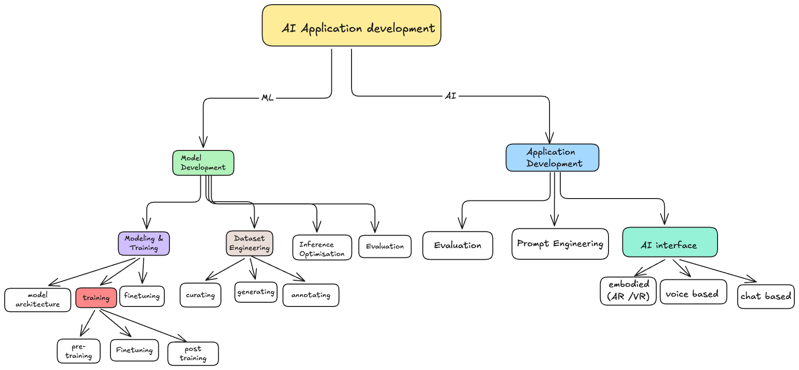

While reading Chip Huyen’s *AI Engineering*, one distinction helped me organize the AI application stack more clearly.

Building an AI application involves two broad areas:

1. **Model development**
2. **Application development**

They overlap in a few places, especially around evaluation and fine-tuning. But they solve different kinds of problems.

Model development focuses on creating and improving the model itself.

Application development focuses on turning that model into something useful for people.

<!-- audio-summary:
The diagram shows how AI application development splits into two tracks. On the model side, model development covers modeling and training, including architecture, pre-training, fine-tuning, and post-training, plus dataset engineering through curating, generating, and annotating data, inference optimization, and evaluation. On the application side, application development covers evaluation throughout the lifecycle, prompt engineering, and AI interfaces such as chat, voice, and embodied AR or VR experiences. Evaluation appears on both sides because it matters while building the model and while shipping the product.
-->

## Model Development

Model development is what we usually associate with traditional machine learning engineering.

It has three main responsibilities:

- Modeling and training
- Dataset engineering
- Inference optimization

Evaluation can also be part of this layer, although it continues throughout application development.

## Modeling and Training

This is the process of choosing a model architecture, training it, and adapting it for a particular task.

Some commonly used tools are PyTorch, TensorFlow, and Hugging Face Transformers.

This work requires specialized ML knowledge.

You need to understand different types of ML algorithms, such as logistic regression, decision trees, clustering, and collaborative filtering.

For neural networks, you may also need to understand feedforward networks, recurrent networks, convolutional networks, and transformers.

Then there is the question of how a model actually learns. That brings in concepts such as gradient descent, loss functions, and regularization.

### Not Every Weight Change Is Training

One point I found useful was the distinction between changing model weights and training a model.

Training always changes the weights.

But changing the weights does not always mean that training happened.

Quantization is a good example. It reduces the precision used to represent a model’s weights. The stored values change, but quantization is considered an optimization technique rather than training.

Training itself can happen at different stages.

### Pre-training

Pre-training means training a model from scratch. Its weights are randomly initialized at the beginning.

For LLMs, the training objective often involves predicting the next token in a sequence of text.

This is usually the most resource-intensive stage by a wide margin. It requires large datasets, significant compute, and a lot of engineering work.

### Fine-tuning

Fine-tuning means continuing to train a model that has already been trained.

Instead of starting with random weights, you begin with weights learned during an earlier training process. You then adapt the model to a particular task, domain, or behavior.

### Post-training

Post-training is the broader process of adapting a pre-trained model to make it more useful, safe, and aligned with what people expect.

It can include supervised fine-tuning, preference optimization, and other alignment methods.

The terms “fine-tuning” and “post-training” can overlap.

The way I understand the distinction is that model developers often use “post-training” for the work they do after pre-training, while application developers may fine-tune an existing model for a specific use case.

## Dataset Engineering

Dataset engineering is about preparing the data needed to train or adapt a model.

That includes:

- Curating data
- Generating data
- Annotating examples
- Removing duplicates
- Tokenizing content
- Retrieving context
- Checking data quality

The difficult part is that foundation models are usually open-ended.

Consider a spam classifier. Its output is either “spam” or “not spam.” The labels are clearly defined, so annotation is relatively straightforward.

Now consider an LLM answering a question.

There may be several valid answers. Evaluating them could involve correctness, relevance, tone, clarity, usefulness, and safety.

That makes annotation much harder.

Traditional ML engineering often works with structured, tabular data. Foundation models work heavily with unstructured data such as text, images, audio, and video.

Because of that, dataset engineering for foundation models involves a different set of problems. Deduplication, tokenization, context retrieval, and quality control become especially important.

## Inference Optimization

Once a model has been trained, it still needs to run quickly and at a reasonable cost.

That is where inference optimization comes in.

The goal is to make the model:

- Faster
- Cheaper
- More memory-efficient
- Easier to serve at scale

This is particularly challenging for LLMs because they are autoregressive.

They generate tokens one after another, and every new token depends on the tokens that came before it.

So even after the training work is finished, serving the model efficiently is a major engineering problem.

## Application Development

Application development is the part that turns a model into something people can use.

It has three main responsibilities:

- Evaluation
- Prompt engineering and context construction
- AI interfaces

## Evaluation

Evaluation is not just a final step before deployment.

It needs to happen throughout the development process.

You use evaluation when:

- Selecting a model
- Comparing prompts
- Testing retrieval strategies
- Measuring progress
- Deciding whether an application is ready to launch
- Monitoring the application in production
- Finding opportunities for improvement

This matters because a response can sound fluent and confident while still being wrong or unhelpful.

Evaluation helps us check whether the system is actually doing the job we built it to do.

## Prompt Engineering and Context Construction

Prompt engineering is about getting a model to produce the desired behavior through its input, without changing its weights.

But the prompt is only one part of that input.

The model might also need:

- Relevant documents
- Examples
- Conversation history
- External tools
- User-specific information
- A memory system

For simple tasks, a clear prompt may be enough.

For more complex tasks, the larger challenge is often constructing the right context and giving the model access to the right tools.

The model provides general capabilities. The application decides what information and tools are available for the current task.

## AI Interfaces

The final responsibility is creating an interface through which people can interact with the AI application.

That could be:

- A chat interface
- A voice assistant
- An embedded product feature
- An AR or VR experience
- An agent that uses tools
- A regular application with AI running behind the scenes

The interface affects more than presentation.

It shapes how users express what they want, review the output, correct mistakes, and decide whether they can trust the system.

## Putting the Two Layers Together

The difference between these layers comes down to the question each one is trying to answer.

Model development asks:

> **How do we build a more capable and efficient model?**

Application development asks:

> **How do we use that model to solve a real problem?**

A capable model is an important part of an AI application, but it is only one part.

The final product also depends on the data, context, tools, evaluations, system design, and interface around the model.

That was my main takeaway: AI engineering is not only about making models more intelligent. It is also about making their capabilities useful.

---

*Based on my notes from Chip Huyen’s book, **AI Engineering**.*